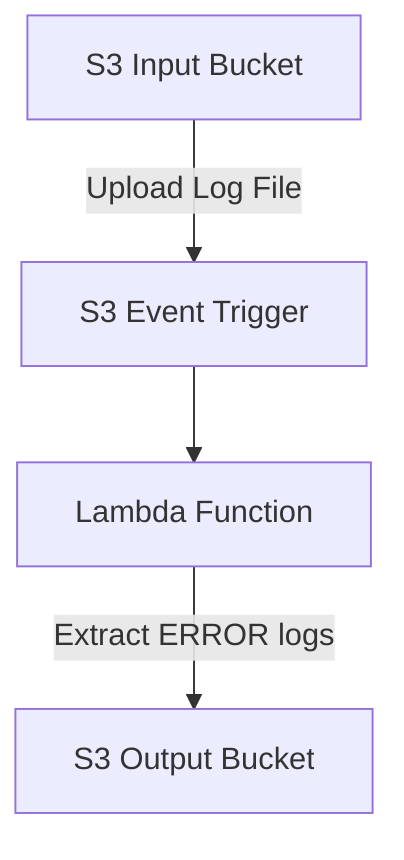

# 🚀 Log File Collection & Processing using AWS + Terraform


## 📌 Overview

This project implements an **event-driven log processing pipeline** using AWS and Terraform.

Whenever a log file is uploaded to an S3 bucket:

* AWS Lambda is automatically triggered
* It scans the file for **ERROR logs**
* Extracts only error lines
* Stores processed output in another S3 bucket

---

## 🏗️ Architecture Diagram



---

## ⚙️ Tech Stack

| Tool       | Purpose                |
| ---------- | ---------------------- |
| AWS S3     | Storage                |
| AWS Lambda | Serverless Processing  |
| IAM        | Access Control         |
| Terraform  | Infrastructure as Code |
| Python     | Log Processing         |

---

## 📁 Project Structure

```bash
log-file-collection-terraform/
│
├── main.tf
├── variables.tf
├── outputs.tf
├── terraform.tfvars
├── lambda/
│   ├── lambda_function.py
│   └── requirements.txt
```

---

## 🔧 Prerequisites

* AWS Account (Free Tier)
* Terraform ≥ 1.0
* AWS CLI configured

```bash
aws configure
```

---

## 🚀 Deployment Steps

### 1️⃣ Clone Repository

```bash
git clone https://github.com/sanathkumar0611/Log_file_collection.git
cd log-file-collection-terraform
```

### 2️⃣ Initialize Terraform

```bash
terraform init
```

### 3️⃣ Validate Configuration

```bash
terraform validate
```

### 4️⃣ Plan Deployment

```bash
terraform plan
```

### 5️⃣ Apply Infrastructure

```bash
terraform apply
```

Type:

```bash
yes
```

---

## 🧪 Testing

### Sample Input File

```txt
INFO Server started
ERROR Database failed
INFO Request completed
ERROR Timeout occurred
```

📤 Upload this file to the **input S3 bucket**

---

## 📥 Expected Output

A new file will be created in the output bucket:

```
errors_<filename>
```

### Output Content

```txt
ERROR Database failed
ERROR Timeout occurred
```

---

## 📊 Terraform Outputs

After deployment:

* ✅ Input Bucket Name
* ✅ Output Bucket Name
* ✅ Lambda Function Name

---


---

## 💰 Cost Optimization (Free Tier)

| Service    | Free Limit         |
| ---------- | ------------------ |
| S3         | 5 GB               |
| Lambda     | 1M requests/month  |
| CloudWatch | Limited free usage |

---

## 🔒 Security Best Practices

* Use least privilege IAM roles
* Avoid hardcoding credentials
* Use environment variables
* Enable logging & monitoring

---

## 🚀 Future Enhancements

* 📢 SNS Alerts for errors
* 📊 CloudWatch Dashboard
* 📦 Dead Letter Queue (SQS)
* 🔄 CI/CD Pipeline (GitHub Actions)
* 🤖 AI-based Log Analysis

---

## ⭐ Why This Project?

✔ Real-world DevOps use case
✔ Serverless architecture
✔ Event-driven automation
✔ Production-ready Terraform
✔ Strong portfolio project

---

## 🏁 Cleanup

Destroy all resources:

```bash
terraform destroy
```

---

## 📌 Conclusion

This project demonstrates:

* Infrastructure as Code using Terraform
* Serverless computing with AWS Lambda
* Event-driven architecture using S3 triggers

A complete **production-grade DevOps automation project** 🚀
